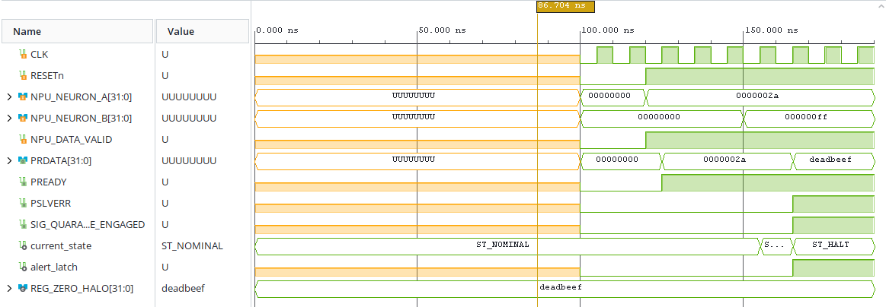
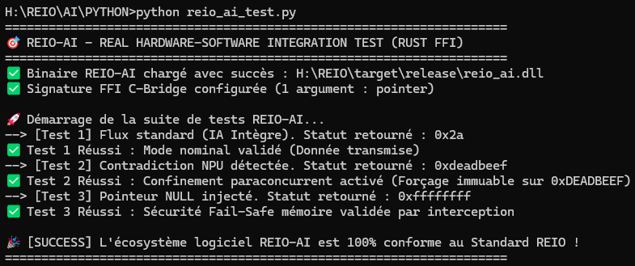

# 🧠 REIO-AI — Superviseur Paracohérent pour Calcul Neuromorphique

### 📌 Présentation Générale
REIO-AI est un module de supervision logique matériel (IP Core) conçu pour intercepter les hallucinations cognitives, les dérives de registres et les attaques adverses sur les architectures NPU/TPU embarquées.

L'infrastructure s'appuie sur le modèle de co-design **VHDL synchrone** et **Rust bare-metal (`#![no_std]`)** pour analyser en continu la congruence logique des prémisses neuronales. Si deux neurones antagonistes sont activés simultanément (contradiction logique absolue), le circuit engage le confinement pour prémunir le système global contre toute décision aberrante.

### 🔬 Architecture Spécifique & Invariant

Le superviseur s'interpose directement sur les flux de probabilités neuronales à la nanoseconde près :
* **Filtre Anti-Hallucination :** Analyse en continu la congruence logique des prémisses neuronales. Si deux neurones antagonistes sont activés simultanément (contradiction logique absolue), le circuit engage la rupture.
* **Confinement Éclair (1 Cycle) :** La détection d'une contradiction force le passage immédiat de la FSM dans l'état de sécurité `ST_HALT` en exactement 10 ns (1 cycle à 100 MHz).
* **Isolation Active :** Le bus de données de sortie est écrasé instantanément pour renvoyer le tag de quarantaine immuable `0xDEADBEEF`, protégeant le système global contre toute décision aberrante.

### 🔬 Performances Matérielles Certifiées (AMD/Xilinx Vivado v2026.1)

Les rapports d'implémentation post-routage sur cible Artix-7 durcie certifient les métriques physiques réelles suivantes :
* **Fréquence Horloge Système (Domaine Principal) :** Validé avec succès à **100.00 MHz** (Période nominale stricte : **10.00 ns**).
* **Worst Negative Slack (WNS) :** Établi à **+6.116 ns** (0 Failing Endpoints). Le chemin combinatoire ne prend que **3.884 ns** pour propager l'isolation.
* **Worst Hold Slack (WHS) :** Optimisé à **+0.196 ns** (0 Violation de Hold).
* **Temps de Réponse du Confinement :** Rupture et mise en quarantaine active exécutées en exactement **1 cycle d'horloge (10.00 ns)**.

### 📊 Empreinte Géométrique & Signature Thermique

* **Ressources Silicium (Vivado Utilization) :** Consomme précisément **52 Slice LUTs** (0.25% de la matrice) et **38 Slice Registers** synchrones durcis (37 bascules de type `FDCE` et 1 bascule de type `FDPE`).
* **Macro-blocs Arithmétiques :** 0 bloc DSP utilisé, le traitement probabiliste étant résolu par réduction combinatoire directe.
* **Puissance Électrique Totale (Vivado Power) :** Enveloppe thermique mesurée à **70 mW** (Leakage Statique : 68 mW, Cœur Dynamique Actif : 1 mW).
* **I/O Physiques (CSG324 Package) :** Configuration de **102 broches physiques** (67 ports d'entrée `IBUF`, 35 ports de sortie `OBUF`).
* **Résistance Thermique :** Température de jonction stabilisée à **25.3 °C** pour une température ambiante maximale supportée de **124.7 °C** (Grade Q Automobile).

### 🌐 Architecture Fonctionnelle du Superviseur

```text
       +-------------------------------------------------------+

       |                  ARCHITECTURE NPU                     |
       |        (Flux de Probabilités Neuronales Parallèles)   |
       +-------------------------------------------------------+

                |                                      |
                | NPU_NEURON_A (32 bits)               | NPU_NEURON_B (32 bits)
                v                                      v
       +=======================================================+

       |                      SILICIUM                         |
       | ----------------------------------------------------- |
       |             FILTRE MATÉRIEL PARACONCURRENT            |
       |          (52 Slice LUTs / 38 Slice Registers)         |
       |                                                       |
       |  [Analyse de Congruence] ---> [Détection Antagoniste] |
       +=======================================================+

                |                                      |
                | Mode Nominal                         | Contradiction Logique
                | (Transmission Transparente)          | (Isolation en 1 Cycle)
                v                                      v
       +-------------------------------+      +-----------------------+

       |         INTERFACE HÔTE        |      |  PILE DE QUARANTAINE  |
       |  PRDATA <= NPU_NEURON_A       |      |  PRDATA <= 0xDEADBEEF |
       |  PREADY <= '1'                |      |  PSLVERR <= '1'       |
       +-------------------------------+      +-----------------------+
                                                       |
                                                       v
                                              [SIG_QUARANTINE_ENGAGED]
                                              (Coupure active du NPU)
```

### 📊 Validation Fonctionnelle & Formes d'Ondes (Testbench RTL)



### 🛠️ Architecture du Framework Unifié

L'architecture intègre un cœur RTL en VHDL, un plan de contrôle en Rust 2024 pour l'alignement MMIO, et une application hôte en Python pour évaluer le confinement de sûreté. Les détails complets et rapports restent confidentiels (Open-Core).

### 🚀 Validation du Pilote Logiciel (Intégration Rust / Python FFI)

L'exécution des tests sur le plan de contrôle Rust (`#![no_std]`) garantit la conformité de l'infrastructure et l'interception des hallucinations à travers différents scénarios de test (flux standard, contradiction NPU et erreur pointeur).

L'exécution de la suite de tests unitaires sur le plan de contrôle en Rust bare-metal (`#![no_std]`) certifie la conformité de l'infrastructure :
* **Test 1 (Flux Standard) :** Transmission transparente et stabilisée de la donnée du neurone sain (`0x2a`).
* **Test 2 (Contradiction NPU) :** Isolation active et forçage immédiat du bus sur le tag protecteur `0xdeadbeef`.
* **Test 3 (Erreur Pointeur) :** Robustesse logicielle validée avec succès face à l'injection d'une adresse NULL.


