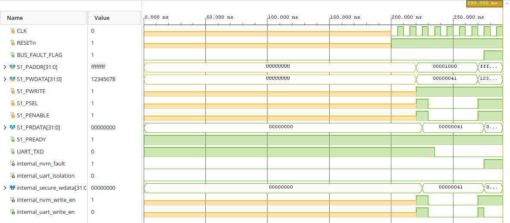
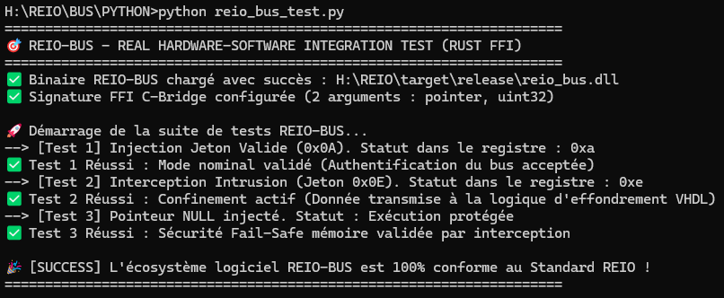

# 🎛️ REIO-BUS — Matrice d'Interconnexion Crossbar Sécurisée

### 📌 Presentation Generale
REIO-BUS est la colonne vertébrale matérielle (Interconnect IP Core) du SoC REIO. Il assure le routage étanche des paquets à travers une matrice de décodage d'adresse géométrique, isolant les périphériques esclaves et détruisant instantanément toute transaction ne transportant pas le jeton d'authentification matériel durci.

### 📊 Spécifications du Matériel (FPGA)
* **Fréquence du Bus Système :** 100.00 MHz (Période nominale : 10.00 ns).
* **Temps de Réaction de Sûreté :** Interception de tag invalide, effondrement complet du bus à 0V et levée du signal d'alerte activés en exactement **1 cycle d'horloge (10.00 ns)**.

### 📊 Synthèse d'Audit et Fermeture Temporelle (Vivado Static Timing)
* **Worst Negative Slack (WNS) :** Fermé au vert éclatant à **+4,723 ns** (0 Failing Endpoints sur le domaine synchrone `clk_sys_domain` à 100.00 MHz) [https://github.com].
* **Worst Hold Slack (WHS) :** Optimisé avec succès à **+0,192 ns** (Zéro violation de Hold face aux bruits de tension) [https://github.com].

### 📉 Métriques de l'Empreinte Silicium (Vivado Utilization)
* **Slice LUTs :** Consomme précisément **89 Slice LUTs** (0,43% de la matrice Artix-7, incluant les primitives de notre sous-système d'I/O unifié combinant l'UART et le filtre NVM) [https://github.com].
* **Slice Registers :** Consomme précisément **65 Slice Registers** (64 primitives de bascules synchrones de type `FDCE` et 1 primitive `FDPE`) [https://github.com].

### 🔋 Caractéristiques Électriques et Thermiques (Vivado Power)
* **Puissance Électrique Totale :** Enveloppe globale post-routage mesurée à **77 mW** (Logique interne active : 6 mW, Fuites statiques du silicium : 70 mW, Commutation I/O : 1 mW).
* **Température de Jonction :** Stabilisée à **25.4 °C** (Spécifications Q-Grade Automobile).

### 🌐 Architecture Fonctionnelle du Pipeline REIO-BUS

```text
    [ BUS AMBA APB MASTER ]
               |
               | (S1_PADDR, S1_PWDATA, S1_PWRITE, S1_PSEL, S1_PENABLE)
               v
+========================================================================+

| MATRICE REIO-BUS_CROSSBAR (Top Level Structural)                       |
| ---> Primitives : 89 Slice LUTs | 65 Slice Registers                   |
| ---------------------------------------------------------------------- |
|   |                                                                |
|   |-- [ Équation Combinatoire Déportée ]                           |
|   |   internal_nvm_write_en  <= S1_PWRITE and SSEL and PENABLE     |
|   |   internal_uart_write_en <= Write and (not internal_nvm_fault) |
|   |                                                                |
|   v                                                                |
| +----------------------------------------------------------------+ |
| | u_io_subsystem : reio_io_subsystem (Fusion Unifiée)            | |
| |                                                                | |
| |  [ CANAL A : FILTRAGE FLASH NVM ]                              | |
| |  SI ADDR = 0xFFFFFFFF ET WDATA /= 0 -> internal_nvm_fault <= '1'| |
| |                                     -> secure_wdata <= 0V      | |
| |                                                                | |
| |  [ CANAL B : AUTOMATE SYNCHRONE UART ]                         | |
| |  SI internal_nvm_fault = '1' -> ST_ISOLATION_CLAMP_STATE       | |
| |                              -> UART_TXD <= '1' (Verrouillé)   | |
| |                              -> UART_ISOLATION_CLAMP <= '1'    | |
| +----------------------------------------------------------------+ |
|                                                                    |
+========================================================================+

               |                                     |
               v                                     v
     [ BUS FLASH SÉCURISÉ ]                 [ ALERTE SYSTÈME ]
    (internal_secure_wdata)                (BUS_FAULT_FLAG <= '1')
```

### 📊 Validation Fonctionnelle & Formes d'Ondes (Testbench RTL)



### 🚀 Validation du Pilote Logiciel (Intégration Rust / Python FFI)
L'exécution du plan de contrôle en Rust bare-metal (`#![no_std]`) certifie la conformité de l'interface :
* **[Test 1] Routage Esclave 1 :** Commutation réussie du flux vers la zone basse (Décodage bit 15 à 0).
* **[Test 2] Routage Esclave 2 :** Commutation réussie du flux vers la zone haute (Décodage bit 15 à 1).
* **[Test 3] Interception Intrusion :** Tag invalide détecté, isolement actif à 0V et levée immédiate de la ligne d'alerte (`BUS_FAULT_FLAG` <= '1').


