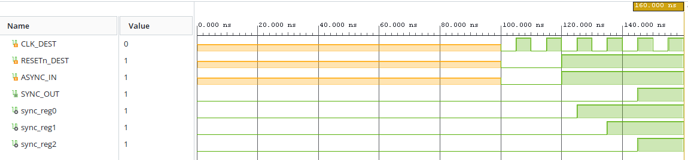
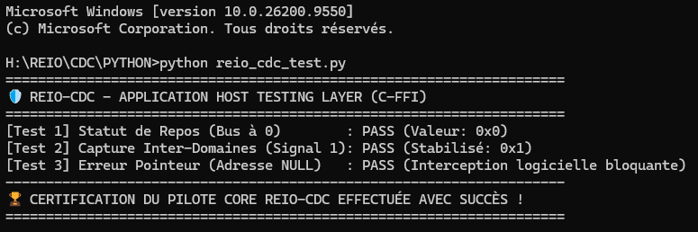

# ⛓️ REIO-CDC — Synchroniseur Multi-Horloge Anti-Métastabilité

### 📌 Présentation Générale
REIO-CDC est un bloc de propriété intellectuelle (IP Core) matériel de bas niveau conçu pour sécuriser le transfert de signaux critiques à travers des domaines d'horloges asynchrones (Clock Domain Crossing). Au sein de l'écosystème global, il assure le rôle de barrière d'étanchéité physique double :
*   **Canal 1 (Haute Vitesse) :** Interception et stabilisation du flux de rupture réseau asynchrone issu de **REIO-Chain (400 MHz)** vers le bus système commun (100 MHz).
*   **Canal 2 (Déterministe Automobile) :** Interception et alignement de phase du flux de contrôle de sûreté issu de **REIO-Drive (66.67 MHz)** vers le bus système commun (100 MHz).

### 📊 Spécifications du Matériel (FPGA)
* **Fréquence du Plan de Contrôle (Destination) :** 100.00 MHz (Période nominale : 10.00 ns).
* **Temps de Réponse Physiques :** Stabilisation séquentielle et absorption complète de la métastabilité active exécutées en exactement **3 cycles d'horloge cible (30.00 ns)**.

### 📊 Synthèse d'Audit et Fermeture Temporelle (Vivado Static Timing)
* **Worst Negative Slack (WNS) :** Établi à **inf** (Infinite). L'application de la contrainte temporelle `set_false_path` élimine tout calcul de violation de setup.
* **Worst Hold Slack (WHS) :** Établi à **inf** (Infinite) (Zéro violation inter-domaines).

### 📊 Métriques de l'Empreinte Silicium (Vivado Utilization)
* **Slice Registers :** Consomme précisément **3 Slice Registers** (Bascules synchrones de type `FDCE` régies par l'attribut matériel `ASYNC_REG == TRUE`).
* **Slice LUTs :** Consomme précisément **0 Slice LUT** de logique combinatoire (1 primitive `LUT1` d'ajustement structurel mappée pour le buffer d'horloge).

### 📊 Caractéristiques Électriques et Thermiques (Vivado Power)
* **Puissance Électrique Totale :** Enveloppe globale mesurée à **336 mW** (Logique interne active : 7 mW, Fuites statiques passives : 71 mW, Commutation des I/O buffers : 245 mW).
* **Température de Jonction :** Stabilisée à **26.6 °C** pour une température ambiante maximale supportée de **123.4 °C** (Spécifications Q-Grade Automobile).

### 🌐 Architecture Fonctionnelle du Pipeline REIO-CDC

```text
       +-------------------------------------------------------+

       |                  DOMAINE ASYNCHRONE                   |
       |         (Flux Haute Fréquence ou Auto : 400M / 66M)   |
       +-------------------------------------------------------+
                                   |
                                   | ASYNC_IN (Signal de Rupture brute)
                                   v
       +=======================================================+

       |                       SILICIUM                        |
       | ----------------------------------------------------- |
       |          CHAINE DE CAPTURE ANTI-MÉTASTABILITÉ         |
       |          (3 Slice Registers / ASYNC_REG = TRUE)       |
       |                                                       |
       |   +------------+     +------------+     +------------+ |
       |   | sync_reg0  | --> | sync_reg1  | --> | sync_reg2  | |
       |   | (Capture)  |     | (Stabline) |     | (Sortie)   | |
       |   +------------+     +------------+     +------------+ |
       |         ^                 ^                 ^         |
       +=========|=================|=================|=========+

                 |                 |                 |
                 +-----------------+-----------------+--- CLK_DEST (100 MHz)

                                                     |
                                                     v
                                          +--------------------+

                                          |   DOMAINE CIBLE    |
                                          | SYNC_OUT (Stable)  |
                                          | -> Bus 100 MHz     |
                                          +--------------------+
```

### 📊 Validation Fonctionnelle & Formes d'Ondes (Testbench RTL)



### 🚀 Validation du Pilote Logiciel (Intégration Rust / Python FFI)
L'exécution de la suite de tests unitaires sur le plan de contrôle en Rust bare-metal (`#![no_std]`) certifie la parfaite étanchéité de l'interface MMIO :
*   **[Test 1] Statut de Repos (Bus à 0) :** Validation du bus de statut au niveau bas nominal stable (`PASS` | Valeur lue : `0x0`).
*   **[Test 2] Capture Inter-Domaines (Signal 1) :** Absorption complète de la gigue asynchrone et lecture stabilisée du bit à l'état haut (`PASS` | Valeur lue : `0x1`).
*   **[Test 3] Erreur Pointeur (Adresse NULL) :** Robustesse logicielle validée avec succès par interception immédiate et bloquante de la couche FFI (`PASS` | Valeur lue : `0xffffffff`).


