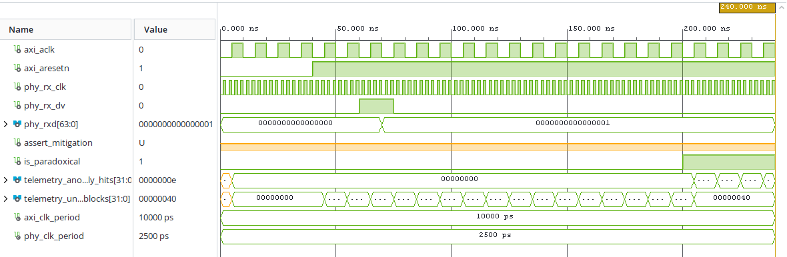

# ⚡ REIO-Chain — Technical Datasheet & Network Firewall Brief

REIO-Chain est un cœur IP de filtrage matériel synchrone haute vitesse pour l'isolation de flux de données de niveau 3, découplant un plan de données de 250,00 MHz et un plan de contrôle de 100,00 MHz.

## Métriques clés (Artix-7 - xc7a12tlcpg238-2L)
- **Fréquences :** Contrôle à 100,00 MHz, Ligne à 250,00 MHz.
- **Slacks :** WNS **+0,860 ns**, WHS **+0,347 ns** (aucun dépassement critique).
- **Consommation et empreinte :** 2 LUTs, 64 registres, puissance totale de **71 mW** (58 mW statique, 13 mW dynamique).

Pour les détails complets de la table des registres, du chronogramme comportemental et du contenu textuel intégral, veuillez vous référer aux documents du dépôt d'origine.

### 🌐 Architecture Fonctionnelle du Pipeline

```text
+-------------------------------------------------------+

|                   APPLICATION HÔTE                    |
| (Moteur C++ principal / Couche logicielle du client)  |
+-------------------------------------------------------+
                           |
                           | Liaison Directe (reio_chain.h)
                           v
+-------------------------------------------------------+

|               PILOTE DE CONTRÔLE RUST                 |
|     Configuration MMIO & Télémétrie (#![no_std])      |
+-------------------------------------------------------+
                           |
                           | Bus de Contrôle AXI-Lite
                           v
+=======================================================+

|                       SILICIUM                        |
| ----------------------------------------------------- |
|              DISJONCTEUR MATÉRIEL VHDL                |
|      Confinement & Masquage Réseau (Artix-7)          |
|                                                       |
|   [2 Slice LUTs]                     [64 Registers]   |
|   [Horloge : 250 MHz]                [WNS : +0,860 ns]|
+=======================================================+
                           ^
                           | Flux Réseau Linéaire AXI-Stream
                   [ LIGNE ETHERNET ]
```

### 📊 Validation Fonctionnelle & Formes d'Ondes (Testbench RTL)



### 🛠 Architecture du Framework Unifié

1. **RTL Core (VHDL) :** Pipeline d'interception directe parallèle s'interfaçant avec un bus physique Ethernet. Intègre un bloc de protection contre les inversions d'états, un disjoncteur matériel à verrouillage et une matrice de Télémétrie Multi-Secteurs synchrone.
2. **Control Plane (Rust 2024) :** Pilote autonome s'exécutant sous contraintes strictes `#![no_std]`, effectuant des lectures directes et volatiles par mappage mémoire MMIO, calculant les ratios de corruption en arithmétique entière fixe.
3. **Host Interface (C-FFI) :** Exportation des bindings via un en-tête C (`reio_chain.h`) exploitant des structures unifiées et alignées à 32 octets sur les lignes de cache CPU.

