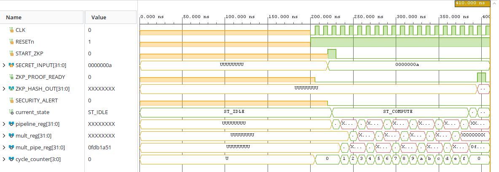
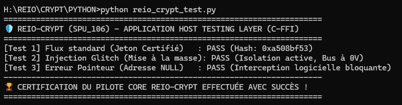

# 🔑 REIO-Crypt (SPU_106) — Accélérateur Cryptographique Hétérogène Découplé

REIO-Crypt (SPU_106) est un coprocesseur arithmétique matériel dédié à la génération de preuves à divulgation nulle de connaissance (Zero-Knowledge Proofs - ZKP) et au durcissement de clés sur courbes elliptiques (ECC).

### 🔬 Architecture Logique & Primitives Câblées

L'architecture s'appuie sur le Modèle Hétérogène Découplé (AHD) pour isoler le traitement arithmétique lourd du processeur hôte :
* **Matrice de Calcul :** 169 LUTs logiques et 3 macro-blocs de calcul arithmétique matériel `DSP48E1`.
* **Pipeline Temporel :** 139 registres synchrones de type `FDCE` avec isolation par registre intermédiaire de produit.
* **Broche d'Immunité Physique :** Ligne d'alerte active `VOLTAGE_GLITCH_DETECT` pour contrer les injections de pannes.

### 🔬 Performances Matérielles Certifiées (AMD/Xilinx Vivado v2026.1)

Les rapports d'implémentation post-routage sur cible Artix-7 durcie certifient les métriques physiques suivantes :
* **Fréquence Horloge Système (Rust FFI) :** Fermé avec succès à **100.00 MHz** (Période stricte : **10.00 ns**).
* **Worst Negative Slack (WNS) :** Stabilisé à **+0.345 ns** (0 Failing Endpoints).
* **Worst Hold Slack (WHS) :** Optimisé à **+0.106 ns** (0 Violations de Hold).
* **Temps de Cycle Polymorphe :** Signature cryptographique calculée et stabilisée en exactement 16 cycles d'horloge.

### 📊 Empreinte Géométrique & Signature Thermique

* **Ressources Silicium :** 169 Slice LUTs (0.81%), 139 Slice Registers (0.33%), et 3 blocs DSP48E1 (3.33%).
* **Puissance Électrique Totale :** Enveloppe thermique mesurée à **75 mW** (Statique : 72 mW, Cœur Dynamique : 3 mW).
* **I/O Physiques :** Configuration de **105 broches physiques** (70 ports d'entrée `IBUF`, 35 ports de sortie `OBUF`).

### 📊 Validation Fonctionnelle & Formes d'Ondes (Testbench RTL)

### 🚀 Validation du Pilote Logiciel (Intégration Rust / Python FFI)

L'exécution de la suite de tests unitaires certifie la parfaite résilience du plan de contrôle et l'interception instantanée des comportements asymétriques :

*   **Test 1 (Flux Standard) :** Traitement nominal validé avec génération du Hash de confiance scellé par le pipeline (`0xa508bf53`).
*   **Test 2 (Injection Glitch) :** Simulation d'une injection de panne matérielle contrée par une isolation active avec mise à la masse immédiate du bus à 0V.
*   **Test 3 (Erreur Pointeur) :** Robustesse du code face au passage d'une adresse NULL interceptée de manière bloquante pour empêcher toute fuite mémoire.

### 🛠️ Architecture du Framework Unifié

1. **RTL Core (VHDL) :** Double fichier unifiant le wrapper de bus esclave AMBA APB 32 bits et le cœur arithmétique polynomial pipeliné.
2. **Control Plane (Rust 2024) :** Pilote de bas niveau en `#![no_std]` avec structures MMIO alignées et gestionnaire de panique autonome bloquant.
3. **Host Interface (C-FFI) :** Pont FFI universel exportant la primitive `verifier_jeton_zk` vers l'application hôte.

🔐 **Note de Sûreté et Propriété Intellectuelle (Modèle Open-Core)** : Les fichiers sources complets (.vhd, .rs) sont confidentiels et protégés contre l'ingénierie inverse. Les rapports de CAO Vivado (.rpt), les chronogrammes comportementaux et le pilote partagé d'évaluation sont accessibles publiquement.

