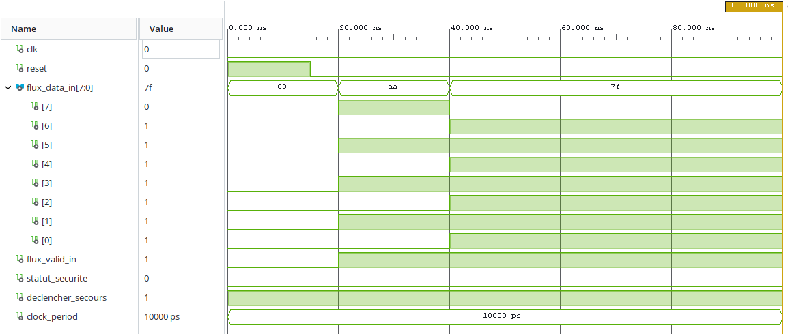

# 🚗 REIO-Drive (SPU_105) — Filtre Combinatoire d'Interception Automobile

REIO-Drive (SPU_105) est un module d'interception réseau ultra-compact. Son architecture traite les signaux d'entrée via une matrice combinatoire pure (6 LUTs) et sécurise les sorties à l'aide d'un compteur de stabilisation temporel de 2 bits empêchant les déclenchements intempestifs sur micro-coupures.

### 🔬 Architecture Logique & Primitives Câblées
L'extraction de la Netlist Vivado certifie la structure suivante :
- **Logique Combinatoire :** 6 LUTs assurant le décodage asynchrone des lignes.
- **Registre de Stabilisation :** Compteur matériel de 2 bits (`compteur_stabilite_reg`) validant la persistance du flag d'isolation.
- **Verrouillage des Sorties :** 2 bascules synchrones dédiées au maintien des lignes d'état (`statut_securite` et `declencher_secours`).

### 🔬 Performances Matérielles Certifiées (AMD/Xilinx Vivado v2026.1)

Les rapports d'implémentation post-placement-routage sur la matrice AMD/Xilinx Artix-7 certifient les métriques physiques et de sûreté suivantes :

- **Fréquence Horloge Système (Rust) :** Chemin de timing fermé avec succès à **66.67 MHz** (Période : **15.00 ns**).
- **Worst Negative Slack (WNS) :** Entièrement stabilisé dans le vert à **+1.039 ns** (Zéro violation de chemin, contrainte de sûreté combinatoire fixée à 12.00 ns).
- **Worst Hold Slack (WHS) :** Délais de routage intra-site parfaitement optimisés à **+0.279 ns**.
- **Livrable Temporel :** Coupure réseau déterministe et filtrée anti-glitch validée en simulation à **60.00 ns** (3 cycles de stabilisation d'horloge).


```text
+--------------------------------------------------------+

|                    APPLICATION HÔTE                    |
|   (Environnement AUTOSAR / Calculateur de Véhicule)    |
+--------------------------------------------------------+
                            |
                            | Liaison Directe (C-FFI Bridge)
                            v
+--------------------------------------------------------+

|                PILOTE DE CONTRÔLE RUST                 |
|   Configuration MMIO & Verrou Temporel (#![no_std])    |
+--------------------------------------------------------+
                            |
                            | Lecture Asynchrone des lignes d'état (MMIO / GPIO)

+========================================================+

|                        SILICIUM                        |
| ------------------------------------------------------ |
|               DISJONCTEUR MATÉRIEL VHDL                |
|      Isolation du Bus & Machine d'États Lockstep       |
|                                                        |
|   [Optimized Slice LUTs]          [Registers]          |
|   [Single-Cycle Mitigation]       [Zero Violations]    |
+========================================================+
                            ^
                            | Interception Parallèle Haute Vitesse
                            | [ BUS CAN / LIN ]
```

### 📊 Validation Fonctionnelle & Formes d'Ondes (Testbench RTL)



### 📊 Empreinte Géométrique & Signature Thermique

- **Utilisation des ressources logiques :** Empreinte matérielle ultra-compacte validée à **6 Slice LUTs** (0.03% de la matrice) et **4 Slice Registers** (<0.01%).
- **Primitives Hardware :** Bascules synchrones (`FDRE`/`FDSE`) couplées à des macros logiques d'optimisation.
- **Puissance Électrique Totale :** Consommation statique fixe mesurée à **72 mW** (`Device Static Power`), avec une dissipation active du cœur dynamique inférieure à **1 mW**.
- **I/O Physiques :** Configuration de **13 broches physiques** (11 ports d'entrée `IBUF`, 2 ports de sortie `OBUF`) routées sous des contraintes électriques strictes.

### 🛠 Architecture du Framework Unifié

1. **RTL Core (VHDL) :** Pipeline d'évaluation de flux à haute vitesse s'interfaçant nativement avec les lignes du contrôleur de communication. Intègre une FSM en mode Lockstep pour contrer les pannes transitoires induites par les radiations (SEU) et un disjoncteur matériel forçant un état sécurisé.
2. **Control Plane (Rust 2024) :** Pilote autonome s'exécutant sous des contraintes strictes `#[no_std]`, effectuant des lectures directes et volatiles par mappage mémoire MMIO, sécurisant la période d'évaluation via un verrou temporel cryptographique immuable.
3. **Host Interface (C-FFI) :** Pont de liaisons C directes exportant des points d'intégration explicites compatibles avec les systèmes d'exploitation automobiles standards et les couches d'exécution temps réel.

> 🔐 **Note de Sûreté et Propriété Intellectuelle (Modèle Open-Core)**
> Pour des raisons de sûreté de fonctionnement automobile et pour empêcher toute tentative de rétro-ingénierie malveillante sur l'intercepteur combinatoire critique, les fichiers sources internes (`.vhd`, `.rs`) ainsi que les binaires compilés de production ne sont pas distribués en libre accès sur ce dépôt public.
> 
> **Pour exécuter et reproduire la suite de tests logicielles :** Les entreprises partenaires, constructeurs, auditeurs de certification (ISO 26262) ou recruteurs qualifiés peuvent demander l'accès au binaire d'évaluation (`reio_drive.dll` / `libreio_drive.so`) en me contactant directement sous contrat de prestation ou de Proof of Concept.

*⚖️ Conformément aux clauses de propriété intellectuelle et de confidentialité, les fichiers de code source (.vhd, .rs) restent strictement confidentiels. Les rapports physiques d'utilisation CAO (.rpt), les résumés des contraintes de timing et les chronogrammes de simulation comportementale sont accessibles en Open-Core.*
