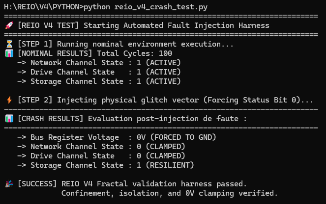

# REIO V4 FRACTAL — ARCHITECTURE MONOLITHIQUE SECURE

## 🏛️ Registre Spécification Technique et d'Attestation Métrologique

Ce répertoire centralise les bulletins de certification physique et les caractéristiques de routage de la génération REIO V4 Fractal. Pour préserver le secret industriel, l'intégralité des codes sources RTL (VHDL) et du firmware applicatif (Rust Bare-Metal `#![no_std]`) est séquestrée hors-ligne sur un environnement de développement sécurisé.

### 🔬 Architecture du Cœur Unifié
La version 4 (Fractal) supprime la fragmentation en consolidant l'infrastructure autour d'un unique cœur de contrôle monolithique et d'un bloc d'I/O à logique trivalente.
*   **Planificateur Asynchrone (Rust) :** Gestionnaire de tâches bare-metal hautement optimisé, orchestrant l'exécution étanche des canaux Réseau, Automobile et Stockage.
*   **Intercepteur Trivalent (VHDL) :** Module d'écrêtage combinatoire sub-nanoseconde analysant les fluctuations de bus et forçant un retour immédiat à la masse (GND, 0V) en 0 cycle en cas d'anomalie.
*   **Tampon de Diagnostic Intégré :** Émetteur série synchrone (UART) directement couplé à la matrice pour attester de l'intégrité de l'amorçage.

### 📊 Indicateurs Métrologiques Validés (Vivado v2026.1)
*   **Worst Negative Slack (WNS) :** **+6,134 ns** (0 Failing Endpoints) sur le domaine d'horloge de production à 100.00 MHz.
*   **Worst Hold Slack (WHS) :** **+0,880 ns** (Marge de sécurité thermique certifiée Q-Grade).
*   **Bilan Électrique Global :** Enveloppe thermique fixée à **73 mW** (72 mW statiques / 1 mW dynamique).

### 🧠 3. Schéma Cinématique du Micro-Noyau et du Planificateur

```text
                 +--------------------------------+

                 |       POINT D'ENTRÉE RUST      |
                 |          fn _start()           |
                 +--------------------------------+
                                 |
                                 v
                 +--------------------------------+

                 |    Initialisation Statique     |
                 | (Network, Drive, Storage = +1) |
                 +--------------------------------+
                                 |
                                 v
                     //--- BOUCLE PRINCIPALE ---//
+---------> +------------------------------------------+

|           |  PHASE 1 : Lecture Volatile BASE_BUS     |
|           |          (0x4000_5000)                   |
|           +------------------------------------------+

|                                |
|                                v
|                 /----------------------------\
|                /   Bit d'anomalie détecté     \
|                \      par le silicium ?       /
|                 \----------------------------/
|                     /                    \
|           [OUI]    /                      \ [NON]
|                   v                        v
|     +---------------------------+    +---------------------------+

|     | PHASE 2 : CONFINEMENT     |    | PHASE 3 : PLANIFICATEUR   |
|     | - Net/Drive state = 0     |    | - Exécution Net   (Si +1) |
|     | - Écrasement BUS à 0 Volt |    | - Exécution Drive (Si +1) |
|     +---------------------------+    | - Exécution Store (Si +1) |
|                   |                  +---------------------------+
|                   v                                |
+-------------------+--------------------------------+
```

### 📊 4. Rapport d'Audit et Banc d'Essai d'Injection de Fautes

```text
H:\REIO\V4\PYTHON>python reio_v4_crash_test.py
=======================================================================
🚀 [REIO V4 TEST] Starting Automated Fault Injection Harness
=======================================================================
⏳ [STEP 1] Running nominal environment execution...
📋 [NOMINAL RESULTS] Total Cycles: 100
   -> Network Channel State : 1 (ACTIVE)
   -> Drive Channel State   : 1 (ACTIVE)
   -> Storage Channel State : 1 (ACTIVE)

⚡ [STEP 2] Injecting physical glitch vector (Forcing Status Bit 0)...
-----------------------------------------------------------------------
📋 [CRASH RESULTS] Evaluation post-injection de faute :
-----------------------------------------------------------------------
   -> Bus Register Voltage  : 0V (FORCED TO GND)
   -> Network Channel State : 0 (CLAMPED)
   -> Drive Channel State   : 0 (CLAMPED)
   -> Storage Channel State : 1 (RESILIENT)

🎉 [SUCCESS] REIO V4 Fractal validation harness passed.
             Confinement, isolation, and 0V clamping verified.
```



