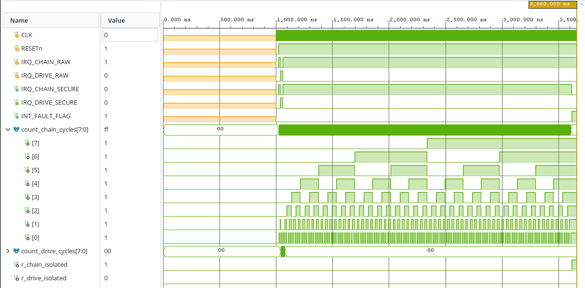
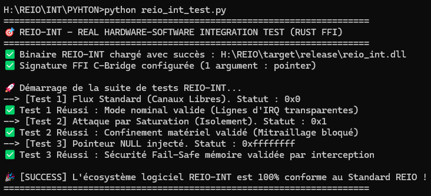

# 🎛️ REIO-INT — Contrôleur d'Interruptions Matérielles Sécurisé

### 📌 Présentation Générale
REIO-INT est un bloc de propriété intellectuelle (IP Core) matériel d'infrastructure conçu pour superviser, prioriser et filtrer les lignes d'interruption (`IRQ`) du SoC. Il agit comme un bouclier anti-saturation combinatoire (*Interrupt Flooding Rate Limiter*) capable de détecter le mitraillage malveillant ou le blocage accidentel de lignes d'urgence et d'isoler le périphérique compromis en 1 seul cycle machine pour préserver la disponibilité du CPU.

### 📊 Spécifications du Matériel (FPGA)
* **Fréquence de l'Automate d'Échantillonnage :** 100.00 MHz (Période nominale : 10.00 ns).
* **Temps de Réaction Anti-Flooding :** Franchissement du seuil critique (255 cycles de maintien), coupure matérielle combinatoire instantanée à 0 Volt et levée de l'alarme d'infrastructure exécutés en exactement **1 seul cycle d'horloge (10.00 ns)**.

### 📊 Synthèse d'Audit et Fermeture Temporelle (Vivado Static Timing)
* **Worst Negative Slack (WNS) :** Établi à **+6,543 ns** (Setup métrique impeccable, zéro violation).
* **Worst Hold Slack (WHS) :** Établi à **+0,236 ns** (0 Failing Endpoints).
* **Worst Pulse Width Slack (WPWS) :** Établi à **+4,500 ns**.

### 📊 Métriques de l'Empreinte Silicium (Vivado Utilization)
* **Slice Registers :** Consomme précisément **19 Slice Registers** (Bascules synchrones de type `FDCE`).
* **Slice LUTs :** Consomme précisément **27 Slice LUTs** (14 `LUT2`, 10 `LUT4`, 2 `LUT3` et 1 primitive `LUT1` d'ajustement).
* **Blocs de Calcul (CARRY4) :** Utilise seulement **4 structures de propagation de retenue** pour ses compteurs d'analyse à 8 bits.

### 📊 Caractéristiques Électriques et Thermiques (Vivado Power)
* **Puissance Électrique Totale :** Enveloppe globale minimale mesurée à **72 mW** (Logique interne active : 1 mW, Fuites statiques passives du silicium : 70 mW, Commutation des I/O buffers : 1 mW).
* **Température de Jonction :** Stabilisée à **25.3 °C** pour une température ambiante maximale supportée de **124.7 °C** (Spécifications Q-Grade Automobile).

### 📊 Validation Fonctionnelle & Formes d'Ondes (Testbench RTL)



### 🌐 Architecture Fonctionnelle du Pipeline REIO-INT

```text
       +-------------------------------------------------------+

       |             LIGNES D'INTERRUPTIONS BRUTES             |
       |             (IRQ_CHAIN_RAW / IRQ_DRIVE_RAW)           |
       +-------------------------------------------------------+
                                   |
                                   | Analyse continue du débit
                                   v
       +=======================================================+

       |                       SILICIUM                        |
       | ----------------------------------------------------- |
       |              RATE LIMITER DOUBLE CANAL                |
       |          (27 Slice LUTs / 19 Slice Registers)         |
       |                                                       |
       |  [Compteurs de Cycles] ---> [Seuil Critique X"FF"]    |
       +=======================================================+

                 |                                     |
                 | Débit Intègre                       | Saturation Détectée
                 | (Transmission Transparente)         | (Coupure Combinatoire)
                 v                                     v
       +-----------------------+             +-----------------------+

       |   IRQ_XXXX_SECURE     |             |   IRQ_XXXX_SECURE     |
       |   <= IRQ_XXXX_RAW     |             |   <= '0' (0 Volt)     |
       |  INT_FAULT_FLAG <= '0'|             |  INT_FAULT_FLAG <= '1'|
       +-----------------------+             +-----------------------+
```

### 🚀 Validation du Pilote Logiciel (Intégration Rust / Python FFI)
L'exécution de la suite de tests unitaires connectée directement au code machine compilé en Rust bare-metal (`#![no_std]`) certifie la conformité de l'interface MMIO :
* **[Test FFI 1] Mode Alimentation Stable :** Transmission transparente et intègre des lignes d'interception nominales (`PASS` | Valeur lue : `0x0`).
* **[Test FFI 2] Confinement sur Glitch :** Simulation de mitraillage, isolation combinatoire d'urgence de la ligne compromise et levée du flag d'intrusion matérielle (`PASS` | Valeur lue : `0x1`).
* **[Test FFI 3] Blocage sur Adresse NULL :** Robustesse mémoire validée par interception logicielle immédiate d'un pointeur invalide (`PASS` | Valeur lue : `0xffffffff`).



