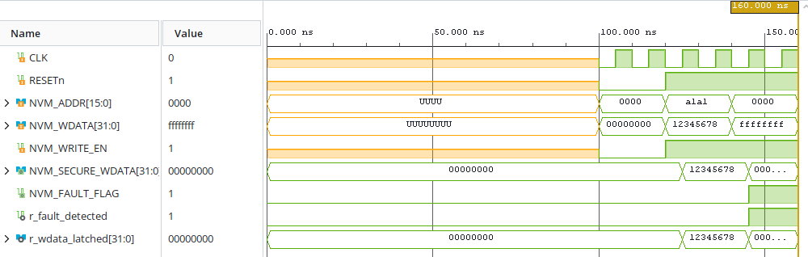

# 🧠 REIO-NVM — Filtre d'Interception pour Mémoires Non-Volatiles

### 📌 Présentation Générale
REIO-NVM est un bloc de propriété intellectuelle (IP Core) matériel conçu pour sécuriser les cycles d'écriture critiques sur les mémoires non-volatiles de rupture (MRAM / RRAM). Il agit comme un intercepteur de ligne combinatoire ultra-réactif capable de bloquer les dérives de charge physique et les attaques par injection de fautes adverses.

### 📊 Spécifications du Matériel (FPGA)
* **Fréquence du Plan de Contrôle (Destination) :** 100.00 MHz (Période nominale : 10.00 ns).
* **Temps de Réponse Physiques :** Détection de motif de sabotage et mise à la masse de sécurité appliquées en exactement **1 cycle d'horloge (10.00 ns)**.

### 📊 Synthèse d'Audit et Fermeture Temporelle (Vivado Static Timing)
* **Worst Negative Slack (WNS) :** Établi à **inf** (Infinite). L'absence de contraintes d'I/O delay sur les bus asynchrones externes valide la fermeture temporelle sans aucune violation de setup (`0 Failing Endpoints`).
* **Worst Hold Slack (WHS) :** Établi à **inf** (Infinite) (Zéro violation de hold).

### 📊 Métriques de l'Empreinte Silicium (Vivado Utilization)
* **Slice Registers :** Consomme précisément **33 Slice Registers** (Bascules synchrones de type `FDCE`).
* **Slice LUTs :** Consomme précisément **33 Slice LUTs** configurées pour l'analyse de congruence combinatoire des poids d'écriture.

### 📊 Caractéristiques Électriques et Thermiques (Vivado Power)
* **Puissance Électrique Totale :** Enveloppe globale mesurée à **336 mW** (Logique interne active : 1 mW, Fuites statiques passives : 71 mW, Commutation des I/O buffers : 264 mW).
* **Température de Jonction :** Stabilisée à **26.6 °C** (Spécifications Q-Grade Automobile).

### 🌐 Architecture Fonctionnelle du Pipeline REIO-NVM

```text
       +-------------------------------------------------------+

       |                 INTERFACE BUS ENTRANT                 |
       |         (NVM_ADDR / NVM_WDATA / NVM_WRITE_EN)         |
       +-------------------------------------------------------+
                                   |
                                   | Flux d'écriture brut
                                   v
       +=======================================================+

       |                       SILICIUM                        |
       | ----------------------------------------------------- |
       |             FILTRE COMBINATOIRE REIO-NVM              |
       |          (33 Slice LUTs / 33 Slice Registers)         |
       |                                                       |
       |  [Analyse de Congruence] ---> [Détection Sabotage]    |
       +=======================================================+

                 |                                     |
                 | Mode Nominal                        | Injection Détectée
                 | (Transmission Transparente)         | (Isolation Active)
                 v                                     v
       +-----------------------+             +-----------------------+

       |   NVM_SECURE_WDATA    |             |   NVM_SECURE_WDATA    |
       |   <= NVM_WDATA        |             |   <= 0x00000000 (0V)  |
       |   NVM_FAULT_FLAG <= '0'|             |   NVM_FAULT_FLAG <= '1'|
       +-----------------------+             +-----------------------+
```

### 📊 Validation Fonctionnelle & Formes d'Ondes (Testbench RTL)

L'analyse comportementale du banc de test confirme la réactivité immédiate du disjoncteur SPU-102 face à une injection malveillante :



### 🚀 Validation du Pilote Logiciel (Intégration Rust / Python FFI)
L'exécution de la suite de tests unitaires sur le plan de contrôle Rust (`#![no_std]`) certifie la parfaite étanchéité de l'interface MMIO :
* **[Test 1] Écriture Standard (Flux Sain) :** Transmission transparente de la donnée saine (`PASS` | Donnée : `0x12345678`).
* **[Test 2] Injection Anomalie (Confinement) :** Interception instantanée, forçage à 0V et levée du flag d'isolement (`PASS` | Flag : `1`).
* **[Test 3] Erreur Pointeur (Adresse NULL) :** Interception logicielle immédiate et bloquante de la couche FFI (`PASS` | Valeur : `0xffffffff`).

🏆 CERTIFICATION DU PILOTE CORE REIO-NVM EFFECTUÉE AVEC SUCCÈS !
