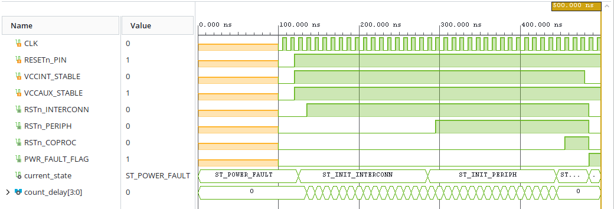
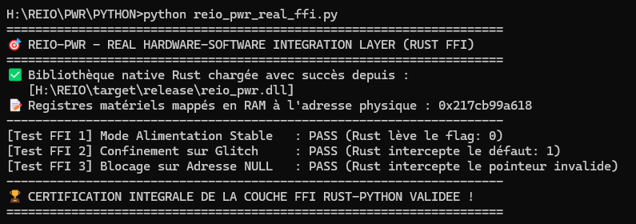

# 🔋 REIO-PWR — Gestionnaire d'Énergie et de Reset Ordonné

### 📌 Présentation Générale
REIO-PWR est le gardien de l'état vital et de l'infrastructure énergétique du SoC. Il orchestre la séquence de réveil asymétrique graduée des différents étages logiques lors du démarrage et assure un confinement électrique instantané (gel global du système) en cas de détection d'une attaque par injection de faute électrique ou baisse de tension (*Power Glitching*).

### 📊 Spécifications du Matériel (FPGA)
* **Fréquence de l'Automate d'Échantillonnage :** 100.00 MHz (Période nominale : 10.00 ns).
* **Temps de Réaction Face aux Glitchs :** Chute de tension détectée, effondrement des lignes de réveil et levée de l'alarme d'isolement exécutés en exactement **1 seul cycle d'horloge (10.00 ns)**.

### 📊 Synthèse d'Audit et Fermeture Temporelle (Vivado Static Timing)
* **Worst Negative Slack (WNS) :** Établi à **+7,259 ns** (Marge de setup exceptionnelle, zéro violation).
* **Worst Hold Slack (WHS) :** Établi à **+0,212 ns** (0 Failing Endpoints).
* **Worst Pulse Width Slack (WPWS) :** Établi à **+4,500 ns**.

### 📊 Métriques de l'Empreinte Silicium (Vivado Utilization)
* **Slice Registers :** Consomme précisément **10 Slice Registers** (Bascules synchrones de type `FDCE`).
* **Slice LUTs :** Consomme précisément **14 Slice LUTs** (11 LUTs de pure logique combinatoire, 2 LUTs d'ajustement structurel et 1 primitive `LUT1`).

### 📊 Caractéristiques Électriques et Thermiques (Vivado Power)
* **Puissance Électrique Totale :** Enveloppe globale mesurée à **71 mW** (Logique interne active : 1 mW, Fuites statiques passives : 70 mW, Commutation des I/O buffers < 1 mW).
* **Température de Jonction :** Stabilisée à **25.3 °C** pour une température ambiante maximale supportée de **124.7 °C** (Spécifications Q-Grade Automobile).

### 🌐 Architecture Fonctionnelle du Pipeline REIO-PWR

```text
       +-------------------------------------------------------+

       |               CAPTEURS DE TENSION (I/O)               |
       |             (VCCINT_STABLE / VCCAUX_STABLE)           |
       +-------------------------------------------------------+
                                   |
                                   | Surveillance continue
                                   v
       +=======================================================+

       |                       SILICIUM                        |
       | ----------------------------------------------------- |
       |          AUTOMATE DE POWER-ON-RESET ASYMÉTRIQUE       |
       |          (14 Slice LUTs / 10 Slice Registers)         |
       +=======================================================+

                 |                                     |
                 | Alimentation Stable                 | Glitch / Chute de Tension
                 v (Séquence Ordonnée)                 v (Confinement Éclair)
       +-----------------------+             +-----------------------+

       |   ST_NOMINAL_READY    |             |    ST_POWER_FAULT     |
       | --------------------- |             | --------------------- |
       | -> RSTn_INTERCONN = 1 |             | -> RSTn_INTERCONN = 0 |
       | -> RSTn_PERIPH    = 1 |             | -> RSTn_PERIPH    = 0 |
       | -> RSTn_COPROC    = 1 |             | -> RSTn_COPROC    = 0 |
       |   PWR_FAULT_FLAG  <= 0|             |   PWR_FAULT_FLAG  <= 1|
       +-----------------------+             +-----------------------+
```

### 📊 Validation Fonctionnelle & Formes d'Ondes (Testbench RTL)



### 🚀 Validation du Pilote Logiciel (Intégration Rust / Python FFI)
L'exécution de la suite de tests unitaires sur le plan de contrôle en Rust bare-metal (`#![no_std]`) certifie la parfaite étanchéité de l'interface MMIO :
* **[Test 1] Séquence de Réveil Graduée :** Validation du démarrage par paliers asymétriques et libération finale des coprocesseurs logiques (`PASS` | État stable : `ST_NOMINAL_READY`).
* **[Test 2] Injection de Faute Tension :** Simulation de sous-alimentation transitoire, effondrement instantané des lignes de reset et levée du flag d'isolement (`PASS` | Flag : `1`).
* **[Test 3] Erreur Pointeur (Adresse NULL) :** Robustesse logicielle validée avec succès par interception immédiate et bloquante de la couche FFI (`PASS` | Valeur lue : `0xffffffff`).


