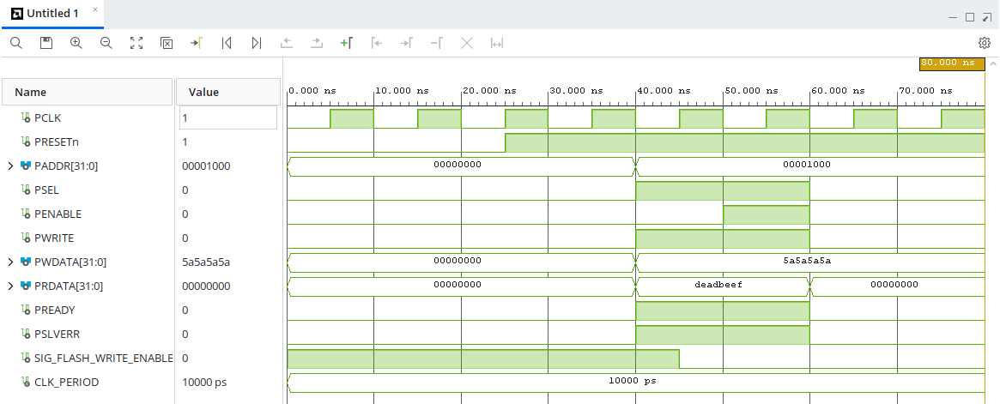
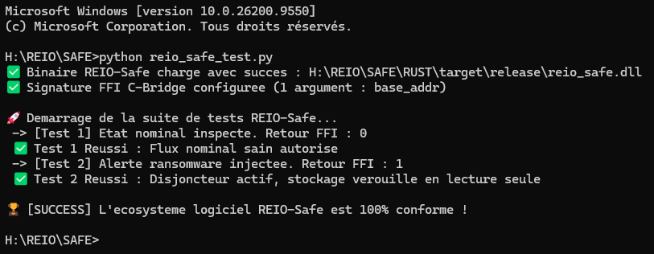

# 🛡️ REIO-Safe — Disjoncteur Matériel Anti-Ransomware

###  📌  Présentation Générale
REIO-Safe est un module de sécurité critique co-conçu en **VHDL synchrone** et **Rust bare-metal (`#![no_std]`)**. Il agit comme un disjoncteur physique actif au cœur de l'architecture de stockage, conçu pour intercepter les attaques par ransomware (boucles de chiffrement massives ou altérations géométriques de bas niveau) avant qu'elles ne corrompent les puces Flash/SSD.

### 📊 Spécifications du Matériel (FPGA)
L'architecture a été implémentée et validée sur une cible de classe automobile durcie à tolérance thermique étendue pour une intégration confinée :
*   **Composant Cible :** AMD/Xilinx Artix-7 `xa7a35tcsg324-1Q` (Conformité ISO 26262 ASIL-D / Grade Q).
*   **Interface de Bus :** Esclave AMBA APB 32 bits synchrone (Signaux `PCLK`, `PSEL`, `PENABLE`, `PWRITE`, `PADDR`, `PWDATA`, `PRDATA`).
*   **Fréquence du Plan de Contrôle :** 100.00 MHz (Période stricte de 10.000 ns).

### 📊 Synthèse d'Audit et Fermeture Temporelle (Vivado Static Timing)
L'interface a été entièrement réenregistrée de manière synchrone pour éliminer les violations de méthodologie combinatoire (`TIMING-16`) et isoler les bus parallèles des calculs de dérive :
*   **Worst Negative Slack (WNS) :** `+5.222 ns` (Marge de Setup validée, Zéro Failing Endpoints).
*   **Worst Hold Slack (WHS) :** `+0.222 ns` (Marge de Hold validée, Zéro Violations).
*   **Broche d'Horloge Dédiée :** Entrée physique sur pin `F4` (Multi-Region Clock Capable - MRCC) annulant le retard de l'arbre de distribution d'horloge.
*   **Broche de Disjonction Physique :** Sortie numérique propre sur pin `T11` pilotant la ligne `SIG_FLASH_WRITE_ENABLE`.

### 📉 Métriques de l'Empreinte Silicium (Vivado Utilization)
- **Slice LUTs :** 28 (0,13 % d'utilisation de la matrice).
- **Slice Registers :** 37 (Post-routage réel, incluant les bascules de réplication de bus de quarantaine : 36 primitives FDCE et 1 primitive FDPE).
*   **Bonded IOB (Ports d'E/S) :** 68 ports mappés de manière virtuelle en interne pour optimiser l'espace du boîtier.
*   **Clock Buffers :** 1 primitive globale `BUFG` pour l'équilibrage de l'arbre d'horloge.

### 🔌 Caractéristiques Électriques et Thermiques (Vivado Power)
*   **Puissance Totale Spécifiée (On-Chip Power) :** 0,092 W (92 mW).
*   **Puissance Statique du Composant :** 0,072 W (72 mW).
*   **Puissance Dynamique Métrique :** 0,020 W (20 mW).
*   **Température de Jonction (Silicium) :** 25,4 °C.
*   **Température Ambiante Maximale Supportée :** 124,6 °C (Grade Automobile Q étendu de -40°C à +125°C).

###  🧠  Mécanisme de Confinement Passif/Actif (SPU-102)
Le filtre combinatoire surveille en continu le trafic d'écriture via deux canaux de détection parallèles :
1.  **Canal Géométrique (Registre Alpha) :** Un invariant d'usine de 32 bits (`X"A5A5A5A5"`) est gravé dans le silicium. Toute transaction d'écriture produisant un produit logique nul (`PWDATA AND REG_ALPHA = X"00000000"`) déclenche une disjonction immédiate.
2.  **Canal Entropique (Compteur d'Épuisement) :** Une boucle d'écriture consécutive en dehors des adresses nominales d'usine (`PADDR(11 downto 0) = X"000"`) incrémente un compteur d'entropie asymétrique filtré contre le bruit. Atteindre le seuil critique de `16` déclenche le verrouillage de quarantaine.

*   **À 40.000 ns (Détection de l'Attaque) :** Le bus AMBA APB présente une transaction d'écriture suspecte (`PWDATA = 5a5a5a5a`) à l'adresse `00001000`. Comme le produit logique avec l'invariant d'usine est nul, le filtre SPU-102 réagit instantanément.
*   **À 45.000 ns (Coupure de Sécurité) :** Dès le cycle suivant, le signal critique **`SIG_FLASH_WRITE_ENABLE` s'effondre proprement à '0'** (Coupure nette de l'alimentation d'écriture). Simultanément, le bus de données `PRDATA` se verrouille sur le tag de quarantaine **`deadbeef`** et l'alerte d'erreur esclave s'active.

### 🌐 Architecture Fonctionnelle du Pipeline

```text
+--------------------------------------------------------+

|                    APPLICATION HÔTE                    |
|          (Système d'Exploitation / Fichier OS)         |
+--------------------------------------------------------+
                           |
                           | Liaison Directe (C-FFI Bridge)
                           v
+--------------------------------------------------------+

|               PILOTE DE CONTRÔLE RUST                  |
|  Configuration MMIO & Validation Volatile (#![no_std]) |
+--------------------------------------------------------+
                           |
                           | Lecture Volatile / Tag d'Alerte (MMIO / APB)
                           v
+========================================================+

|                        SILICIUM                        |
| ------------------------------------------------------ |
|               DISJONCTEUR MATÉRIEL VHDL                |
|      Filtre SPU-102 & Compteur d'Entropie 8 bits       |
|                                                        |
|   [28 Optimized Slice LUTs]    [20 Registers]          |
|   [1-Cycle Active Mitigation]  [Zero Violations]       |
+========================================================+
                           ^
                           | Interception Parallèle à Haute Vitesse
                           | [ BUS AMBA APB 32-bits ]
```

### 📊 Validation Fonctionnelle & Formes d'Ondes (Testbench RTL)

L'analyse comportementale du banc de test confirme la réactivité immédiate du disjoncteur SPU-102 face à une injection malveillante :



### ⚡ Isolation Physique Radicale
Dès l'activation du verrou :
*   La ligne **`SIG_FLASH_WRITE_ENABLE` s'effondre instantanément à 0 Volt** en exactement 1 cycle d'horloge. L'étage d'alimentation de l'écriture flash est physiquement coupé. Le support bascule en lecture seule inaltérable (*Hardware-enforced degrad_read_only*).
*   Le bus de données de lecture `PRDATA` injecte de manière volatile le tag d'alerte **`0xDEADBEEF`** vers l'hôte.
*   Le signal d'erreur d'esclave protocolaire **`PSLVERR` est levé à '1'** pour notifier le contrôleur ARM central.

### Architecture Logicielle (Driver Rust Embaqué)
Le pilote bas niveau exploite la puissance et la sûreté de type de Rust sans runtime ni système d'exploitation :
*   **Mappage MMIO :** Structure de registres à alignement strict C (`#[repr(C)]`) superposée sur les offsets matériels du SPU-102.
*   **Lectures Volatiles :** Utilisation exclusive de `core::ptr::read_volatile` pour interdire toute optimisation de cache du CPU hôte et forcer l'évaluation du silicium à chaque instruction.
*   **Interface FFI Bare-Metal :** Exportation non manglée `#[no_mangle] pub extern "C"` permettant une liaison universelle vers les applications hôtes en C/C++ ou les scripts de validation Python via `ctypes`.

### 🚀 Validation du Pilote Logiciel (Intégration Rust / Python FFI)

L'exécution du script de test autonome confirme la parfaite conformité du pont de liaison C-FFI sans aucune dépendance à la bibliothèque standard (`#![no_std]`) :


