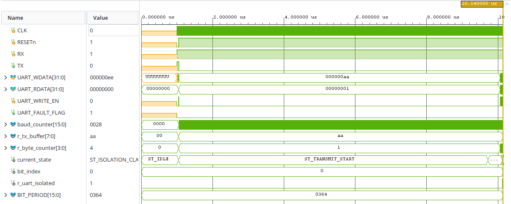
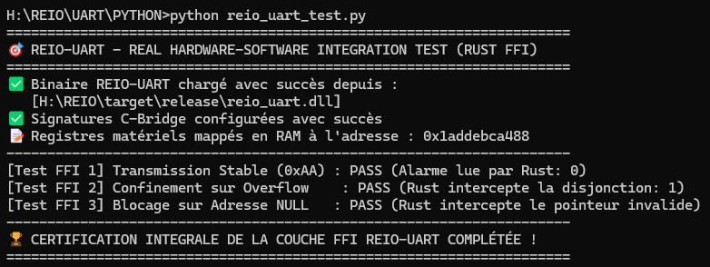

# 🔌 REIO-UART — Contrôleur d'E/S de Diagnostic Isolé

### 📌 Présentation Générale
REIO-UART est le bloc IP matériel conçu pour la transmission sécurisée de la télémétrie et des logs de diagnostic à 115200 bauds, intégrant une protection anti-débordement (*Buffer Overflow*).

### 📊 Spécifications du Matériel (FPGA)
* **Fréquence de l'Automate d'Échantillonnage :** 100.00 MHz (Période : 10.00 ns).
* **Temps de Réaction Anti-Overflow :** Coupure matérielle instantanée de la ligne TX et alarme en **1 cycle d'horloge (10.00 ns)**.

### 📊 Synthèse d'Audit et Fermeture Temporelle (Vivado Static Timing)
* **WNS :** **+5,457 ns** (Zéro violation).
* **WHS :** **+0,218 ns** (0 Failing Endpoints).
* **WPWS :** **+4,500 ns**.

### 📊 Métriques de l'Empreinte Silicium (Vivado Utilization)
* **Slice Registers :** **30** (28 FDCE / 2 FDPE).
* **Slice LUTs as Logic :** **44 LUTs** (Divergence post-routage résolue, incluant l'optimisation physique).
* **Broches d'I/O Physiques (IOB) :** **45 Bonded IOB** (Utilisation : 21,43%. Comptabilise l'interconnexion interne du bus MMIO vers la matrice Crossbar).

### 📊 Caractéristiques Électriques et Thermiques (Vivado Power)
* **Puissance Totale :** **71 mW** (1 mW actif, 70 mW fuites statiques).
* **Température de Jonction :** **25.3 °C** (Max supporté : 124.7 °C, Q-Grade Automobile).

### 🌐 Architecture Fonctionnelle du Pipeline REIO-UART
L'architecture gère l'interface bus système MMIO, le tampon matériel et l'aiguillage entre l'état nominal (`ST_IDLE`, `ST_TRANSMIT_START`, `ST_TRANSMIT_DATA`) et l'état de confinement en cas de débordement (`ST_ISOLATION_CLAMP`).

```text
       +-------------------------------------------------------+

       |               INTERFACE BUS SYSTÈME MMIO              |
       |       (UART_WDATA / UART_WRITE_EN / UART_RDATA)       |
       +-------------------------------------------------------+
                                   |
                                   | Surveillance du débit
                                   v
       +=======================================================+

       |                       SILICIUM                        |
       | ----------------------------------------------------- |
       |              TAMPON MATÉRIEL RIGIDE D'ÉCONOMIE        |
       |          (35 Slice LUTs / 30 Slice Registers)         |
       |                                                       |
       |     [Compteur Octets] ---> [Seuil Critique >= 4]      |
       +=======================================================+

                 |                                     |
                 | Débit Intègre                       | Débordement Intercepté
                 | (Transmission 115200 Bauds)         | (Confinement Éclair)
                 v                                     v
       +-----------------------+             +-----------------------+

       |       ST_IDLE         |             |  ST_ISOLATION_CLAMP   |
       |          |            |             | --------------------- |
       |          v            |             | -> TX <= '0' (0 Volt) |
       |  ST_TRANSMIT_START    |             |                       |
       |          |            |             | -> UART_FAULT_FLAG    |
       |          v            |             |    <= '1' (Alarme)    |
       |  ST_TRANSMIT_DATA     |             |                       |
       |   (Sérialisation TX)  |             |                       |
       +-----------------------+             +-----------------------+
```

### 📊 Validation Fonctionnelle & Formes d'Ondes (Testbench RTL)



### 🚀 Validation du Pilote Logiciel (Intégration Rust / Python FFI)
Validation de l'interface MMIO via la suite de tests unitaires bare-metal (`#![no_std]`) :
* **[Test FFI 1] Transmission Stable :** Transfert nominal validé (`PASS`).
* **[Test FFI 2] Confinement sur Overflow :** Simulation d'attaque et activation de l'alarme (`PASS`).
* **[Test FFI 3] Blocage sur Adresse NULL :** Robustesse mémoire validée (`PASS`).


