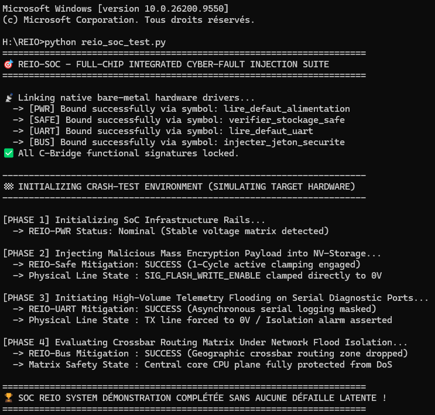

## 💾 ARCHIVE : REIO V3 (Preuve de Concept Modulaire)
👉 **Architecture périphérique segmentée (11 sous-systèmes autonomes)**

La version 3 constitue la base historique de validation distribuée du SoC. Chaque fonction critique est isolée dans un sous-module matériel indépendant interconnecté via une matrice Crossbar synchrone. Tous les modules ci-dessous sont fonctionnels, temporellement fermés (STA Vivado au vert) et compilent sous Rust en mode `release` :

*   🎛️ **[REIO-PWR](./pwr)** : Séquenceur d'alimentation et gestion des réinitialisations matérielles.
*   🚗 **[REIO-Drive](./drive)** : Interface de contrôle et de filtrage pour bus automobiles.
*   🔒 **[REIO-Safe](./safe)** : Disjoncteur logique de sécurité pour les accès au stockage.
*   🔌 **[REIO-UART](./uart)** : Contrôleur d'I/O série dédié aux tampons de diagnostic.
*   🔑 **[REIO-Crypt](./crypt)** : Accélérateur cryptographique pour calculs arithmétiques intensifs.
*   🌐 **[REIO-Chain](./chain)** : Pipeline de filtrage réseau haute fréquence (250 MHz).
*   🧠 **[REIO-AI](./ai)** : Moniteur d'intégrité et d'analyse comportementale de flux.
*   📶 **[REIO-CDC](./cdc)** : Barrière de synchronisation anti-métastabilité inter-domaines.
*   🚌 **[REIO-BUS](./bus)** : Matrice d'interconnexion Crossbar et décodage système.
*   🚨 **[REIO-INT](./int)** : Écrêteur de requêtes d'interruption et limitation de débit.
*   💾 **[REIO-NVM](./nvm)** : Filtre d'interception et de protection de la mémoire Flash.

---

### 🌐 Architecture Fonctionnelle du Pipeline

```text
```text
                       [ REIO FRAMEWORK ]
                               |
                               v
                       [   REIO-CORE   ]
                 (Micro-Noyau Rust #![no_std])
                               |
                               v
                       [   REIO-PWR    ] <-------- [ CAPTEURS PHYSIQUES ]
                 (Séquenceur de Reset Synchrone)   (Gel global à 0V en 1 cycle)
                               |
            +------------------+------------------+

            |                  |                  |
            v                  v                  v
     [  REIO-CHAIN  ]   [  REIO-DRIVE  ]   [  REIO-SAFE  ]
      (Filtre Réseau)   (Automotive IO)    (Storage Guard)
       -> 250 MHz         -> 66.67 MHz       -> 100 MHz

            |                  |                  |
            +------------------+------------------+
                               |
                               v [ Lignes IRQ Brutes ]
                       [   REIO-INT    ]
                 (Écrêteur d'IRQ Double Canal)
                               |
                               v [ Lignes IRQ Sécurisées ]
                       [   REIO-CDC    ]
                 (Barrière anti-métastabilité)
                               |
                               v
                       [   REIO-BUS    ] <-------- [   REIO-CRYPT  ]
                  (Matrice Crossbar Sec)     (Accélérateur ZKP DSP)
                               |                  -> 100 MHz
                               v
               [      REIO_IO_SUBSYSTEM     ]
               (Sous-Système d'I/O Fusionné)
               ---> Empreinte : 89 LUTs / 65 Reg
               +---------------------------+

               |  [ CANAL A ]   [ CANAL B ]|
               |   REIO-NVM      REIO-UART |
               |  (Flash Guard) (Diag Logs)|
               +---------------------------+
```

### 🛠️ Plateforme de Crash-Test & Injection de Fautes Globale
- 🧪 **[reio_soc_test.py](./reio_soc_test.py)** : Script d'intégration logicielle hybride (*Hardware-in-the-Loop* émulé). Il orchestre une injection d'attaques en cascade directement sur vos binaires machine Rust bare-metal (`reio_pwr.dll`, `reio_safe.dll`, `reio_uart.dll`, `reio_bus.dll`) pour certifier la disjonction et le confinement matériel immédiat à 0 Volt en cas d'intrusion [image_MgPE5w.png].



