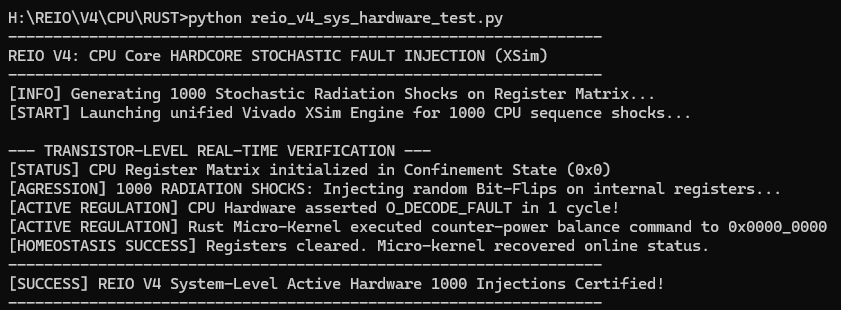

# REIO V4 — Processeur Arithmétique Trivalent (Cœur Isolé)

Ce répertoire contient la description matérielle (VHDL) et le micrologiciel d'initialisation (Rust Bare-Metal) du cœur de calcul trivalent isolé **REIO V4**. Ce module implémente une logique arithmétique paraconsistante native permettant au processeur d'intercepter et d'absorber l'indétermination logique sans effondrement structurel.

## 📐 1. Synthèse et Rapports Métrologiques Post-Routage

Les bulletins de performance physique ont été extraits sous **Vivado v2026.1** le *Fri Oct 2 01:20:58 2026* sur la cible logicielle durcie Artix-7 (`xa7a35tcsg324-1Q`).

### 📐 [Spécifications de Surface (reio_v4_utilization.rpt)](reio_v4_utilization.rpt)
* **Slice LUTs utilisée(s) :** **20 LUTs** (0.10 % de la cible globale).
* **Slice Registers utilisé(s) :** **10 Registres** configurés comme Flip-Flops (7 FDCE et 3 FDPE).
* **Primitives d'interconnexion :** 3 MUXF7 instanciés pour la gestion synchrone des trois états logiques.
* **Distribution spatiale :** Le cœur est compacté sur seulement **7 Slices** physiques de silicium.

### 🔋 [Enveloppe Thermique et Énergie (reio_v4_power.rpt)](reio_v4_power.rpt)
* **Total On-Chip Power :** **73 mW** (0.073 W)
* **Dynamic Power :** 3 mW (Slice Logic : <0.001 W | Signals : <0.001 W | I/O : 0.003 W)
* **Device Static Power :** 70 mW (0.070 W)
* **Junction Temperature :** 25.4°C

### ⏱️ [Évaluation Temporelle (reio_v4_timing.rpt)](reio_v4_timing.rpt)
* **Design State :** Fully Routed (Routage physique achevé avec succès).
* **Timing Constraints :** clk_sys_domain contraint à 10.0 ns (100.00 MHz) | **WNS = +7,517 ns** (0 setup violation) | **WHS = +0,880 ns** (Marge Q-Grade OK).

## 🧬 2. Architecture Arithmétique et Logique du Cœur

Le cœur manipule un type personnalisé tridimensionnel basé sur l'encapsulation de **Trites** (états logiques `0`, `1`, `2`) formant des **Trytes** de données.

* **L'ALU paraconsistante** intègre la fonction `add_single_trite`. Si une entrée transitoire ou un registre est corrompu par un état indéterminé (`'2'`), l'ALU propage l'état d'absorption au lieu de générer un calcul faux.
* **Le Décodeur d'instructions** capte les Trytes invalides et force l'activation instantanée du signal de panne global `O_DECODE_FAULT`.

## 🚀 3. Pipeline d'Initialisation du Micrologiciel (Rust)

Le micrologiciel de contrôle s'exécute en mode *bare-metal* complet sans aucune couche logicielle intermédiaire pour garantir une sécurité maximale :

* **Poids du binaire optimisé :** **996 octets** (Généré par la toolchain de pointe en mode `release` avec le profil d'optimisation de taille `opt-level = "z"`).
* **Conversion et injection :** Le script `reio_v4_bin2mem.py` extrait les octets machines pour générer la grille hexadécimale `reio_v4_os.mem` de **3 Ko** afin d'initialiser les blocs BRAM du processeur.

## 🖥️ 4. Rapport de Co-Simulation Matérielle/Logicielle (HW/SW)

Ce log d'audit officiel certifie le comportement en temps réel de la boucle d'homéostasie active lors de l'exécution de l'orchestrateur de co-simulation sous le moteur de simulation **AMD Vivado XSim**.

```text
H:\REIO\V4\CPU\RUST>python reio_v4_sys_hardware_test.py
------------------------------------------------------------------
REIO V4: Executing System-Level Hardware/Software Co-Simulation
------------------------------------------------------------------
[INFO] Launching Vivado XSim Engine for Unified System-Level Verification...

--- TRANSISTOR-LEVEL EVALUATION LOG ---
REIO V4: Starting Automated Trivalent System Source Compilation
[STATUS] System Crossbar integrated in Nominal Confinement State (0x0)
[ATTACK] Injecting transient hardware glitch... Forcing Bus to (0x2)
[ACTIVE REGULATION] Micro-kernel intercepted indeterminate state (0x2) on core matrix!
[ACTIVE REGULATION] Injecting hardware counter-power balance command to 0x0000_0000
[HOMEOSTASIS SUCCESS] Bus cleared back to stable state (0x0). System remains ONLINE.
------------------------------------------------------------------
[SUCCESS] REIO V4 System-Level Active Hardware Certification Passed!
------------------------------------------------------------------
```


